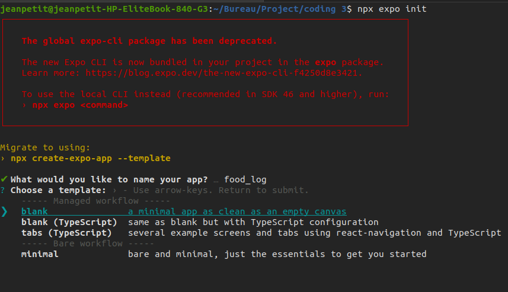
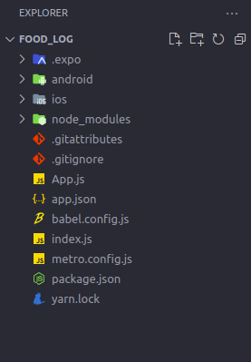
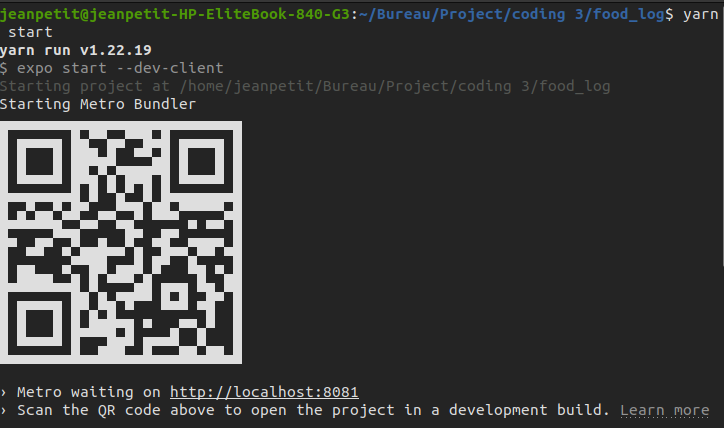
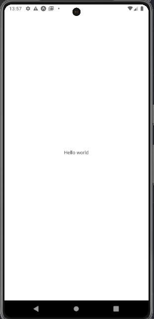

# FoodAgenda

### step
1. create and a hello world app
  open you terminal and follow these instructions:
  ```
    npx expo init
  ```
  

  ```
    cd food_log
  ```
  open this folder with your preference editor and you will this configuration<br>
  

  at the end execute this command to launch your Hello world

  ```
   yarn start or npm start
  ```
  

  open your expo Go application and scan Qrcode below and you see this result:<br>
  

1. Build APK of your hello world app
   
   build apk with react native requiert and expo count and them you can login ou signup via this [login or sign up expo]("https://expo.dev/accounts")

   after open your terminal and run this command to install eas-cli
   ```
    npm i -g eas-cli
   ```
   at the end run 
   ```
   eas build -p android --profile preview
   ```

if you have and ios device
change the content of eas.json file by:
```
{
  "build": {
    "preview": {
      "ios": {
        "simulator": true
      }
    },
    "production": {}
  }
}

```
and then run rather:
```
    eas build -p ios --profile preview
```

### problem with nodejs

```
cd ~
```
```
curl -sL https://deb.nodesource.com/setup_16.x -o /tmp/nodesource_setup.sh
```
```
sudo bash /tmp/nodesource_setup.sh
```
```
sudo apt install nodejs
```

